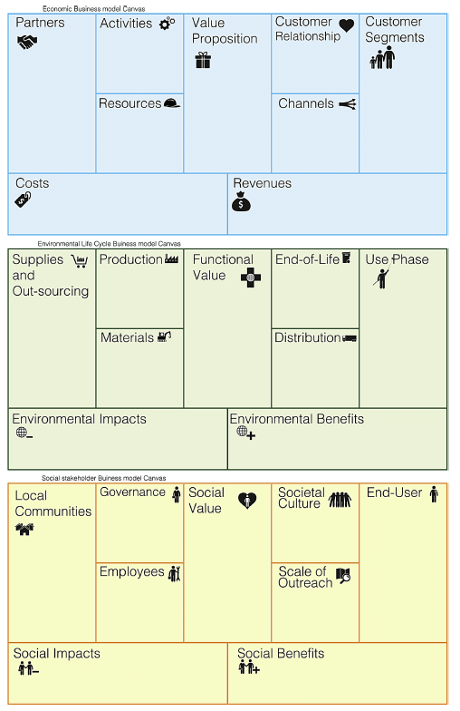
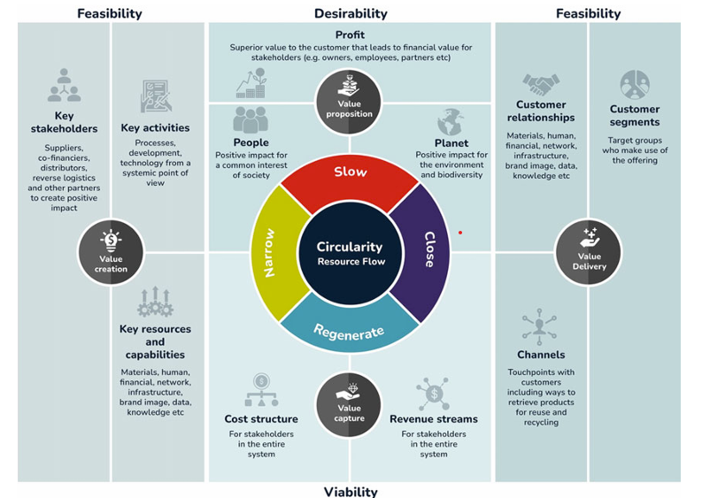
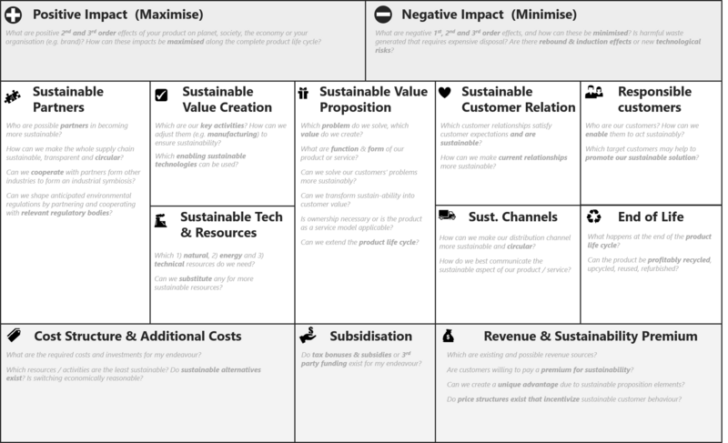

## Business Models and Sustainable Innovation

The business model is a crucial component of any project, especially in the context of the DaWetRest project, which aims to develop sustainable business models for biodiversity conservation in the Middle Danube region. A well-defined business model not only outlines how a project creates, delivers, and captures value but also serves as a strategic framework for aligning various stakeholders' interests and objectives. In this section, we will give introduction to the concept of comprehensive business models that integrates economic, environmental, and social dimensions, ensuring that biodiversity conservation efforts are both effective and sustainable.

A business model describes how an organization **creates, delivers, and captures value** [@interactiondesign2025business]. In the context of sustainable innovation, this concept expands to include ecological and social value creation, not just economic profit. Researchers define a sustainable business model as one that delivers a “sustainable value proposition” to customers and all stakeholders, and captures economic value while maintaining or regenerating natural, social, and economic capital beyond the firm’s boundaries [@ludeke2017business]. In other words, sustainable business models integrate the triple bottom line of people, planet, and profit into the core business strategy. This broader perspective is crucial for projects like DaWetRest, which aim to generate environmental and social benefits (restored ecosystems, community well-being) alongside economic viability. Sustainable innovation often requires rethinking traditional business logic. Instead of viewing environmental or social goals as externalities or costs, sustainable business models embed these goals as central elements of value creation. For example, a company might innovate by offering a product-as-a-service (to reduce waste) or by designing products for reuse and recycling from the outset. Such innovations need robust business models to ensure they are financially sustainable while achieving positive impact. Effective business model development methodologies provide structured frameworks to map out how an initiative will deliver value to all stakeholders and remain viable over time.

## Methodology overview

In this section we provide structured approach to develop the business model, including theoretical framework for business models, data collection, analysis and stakeholder engagement.

## Business Model Canvas

The foundation of the methodology for developing the business model for the Dawetrest project is based on the original Business Model Canvas (BMC), developed in @osterwalder2010business. The BMC was originally created in Osterwalder’s doctoral work [@osterwalder2004business], where he designed a practical tool to represent how an organization creates, delivers, and captures value in a clear, visual format. BMC was developed together with a large group of academics, practitioners and supporters working in strategic management field. The BMC was originally created to help entrepreneurs and organizations move away from static business plans and toward more dynamic, iterative modeling. This approach is particularly useful in innovation-driven and multidisciplinary projects such as Dawetrest, where various factors from scientific, environmental, public, and community sectors are involved.

While the original BMC focuses primarily on economic value creation, it serves as a basic framework upon which sustainability extensions can be built. For the Dawetrest, this means starting from the classic nine-block structure and progressively integrating additional considerations relevant to nature-based solutions, biodiversity, and other social and ecological dimensions of sustainable development. In this context, value propositions not only include economic benefits (e.g., eco-tourism or sustainable aquaculture revenues) but also ecological and social gains, such as habitat restoration or community involvement. The BMC thus provides the backbone of the Dawetrest business model while allowing for iterative development toward a sustainability-oriented, multi-value approach.

{#fig-bmc}

The BMC consists of nine interconnected building blocks as shown in @fig-bmc. As figure shows, the nine components are: customer segments, value proposition, channels, customer relationships, revenue streams, key resources, key activities, key partnerships, and cost structure. We explained the business model explains how the value is created, delivered, and captured. Following this defition, left part of the figure (partners, activities and resources) describes how the value is created, the right part (customers, customer relationships and channels) describes how the value is delivered, and the bottom part (cost structure and revenue streams) describes how the value is captured. Or in another way, left part i operational, right part strategic and bottom financial. This structure provides a systematic way to analyze and design business models and has become widely adopted across sectors for its simplicity and clarity. We later explain further building blocks, altering the traditional building blocks to some extent.

In designing the business model for all three DEMOS, the Value Proposition has the central role because it defines the unique value that the project offers to its various stakeholders. The value proposition answers a fundamental question: what value does the project provide to customers, beneficiaries and other stakeholders? The emphasize in Dawetrest is on nature based solutions, so the value proposition should be multi-dimensional because the project aims to generate not only economic value but also significant ecological and societal benefits. 

The customer segments are the different groups of people or organizations that the project aims to reach and serve. In the context of Dawetrest, these segments may include local communities, businesses, government agencies, NGOs, and other stakeholders involved in biodiversity conservation and sustainable development. Each segment may have different needs and expectations, which should be addressed this component.

Value proposition and customers are connected with the channels and customer relationships. The channels describe how a company, organization, or system reaches customer segments to deliver the value proposition. More simply put, they are how customers first hear about project output, how they buy product or service, and how they receive it. Channels can be physical like stores, or digital like websites, apps, social media, or email. Customer segments describe the different groups of people or organizations that a business or project aims to serve. Identifying and understanding these segments is essential because each group may have distinct needs, behaviors, and ways of interacting with the value proposition.  

Next building blocks describes how the value is created. It describes the elements that are under control of the project partners and stakeholders involved. Key resources are the most important assets we need to deliver value proposition. These can be physical things like pools in green hatchery, intellectual things like patents and brand names, human resources like talented developers or salespeople, or financial resources like investment capital. Key activities are the main actions project must perform to fulfill goals. This could involve designing products, running marketing campaigns, managing logistics, building software, or offering customer support. The focus should be on a few critical activities that drive everything else. Key partnerships refer to the external relationships the organization establishes to optimize operations, reduce risks, or access important resources and activities it cannot perform alone. Partners can include project partners, local goverment, government agencies, non-profit organizations, or distribution partners. Partnerships can be driven by various motivations, such as sharing resources, acquiring specialized capabilities, achieving economies of scale, or entering new markets.

Revenue streams and cost structure are the two final components of the Business Model Canvas. They describe how the organization captures economic value and how it manages the financial side of its operations. Revenue component explains how income is generated from each customer segment. Revenue streams are critical part of NBS business projects because they are more oriented toward ecological sustainability and social impact than traditional business models. This means that revenue streams may not be as straightforward as in conventional businesses, where the focus is primarily on profit maximization. In the context of Dawetrest, revenue streams could include payments for ecosystem services, grants, donations, or income from sustainable tourism activities. The cost structure, on the hand, describes all the costs and expenditures that the organization incurs to operate its business model. This includes costs associated with key activities, resources, and partnerships. Understanding the cost structure is essential for determining the financial viability of the business model and identifying areas where efficiency can be improved.Costs are mostly divide in two groups: 1) fixed costs 2) variable costs. In choosing cost strategy, two different concepts can be distinguished: cost-driven (minimizing costs wherever possible) and value-driven (focus on design  and value creation; premium value proposition).

In nutshell, BMC reduces complexity of operational and strategic planning without losing the richness or the intricate relationships that hold everything together. Instead of getting lost in endless details, it offers a sharp, connected view of how a business truly works.

## Business Model Canvas and Sustainability-Oriented Extensions

The BMC explained in previous chapter provides a comprehensive and fast overview of a business model on a single page. It is praised for being easy to use and understand, facilitating brainstorming and iteration of business ideas [@businessmodeltoolbox]. Importantly, the canvas format encourages alignment: it “gets everyone on the same page” about how the business will run [@businessmodeltoolbox].

However, the classic BMC has limitations when it comes to sustainability. It lacks explicit sections for environmental or social considerations, which represent fundamental part of sustainable development. The original canvas focuses on value for the customer and the firm (often short-term financial value), without prompting creators to consider long-term environmental costs. Osterwalder & Pigneur’s 2010 framework was product-centric and profit-centric, which can lead to omitting factors like negative externalities of a product/service [@gerlach2015sustainable]. In recognition of these gaps, practitioners and researchers have developed several extensions to the BMC to better incorporate sustainability and circular economy principles. Therefore, the concept was adapted to include additional dimensions that address the environmental and social impacts of business activities and it is called sustainable business model canvas (SBMC). Below, we summarize these leading frameworks and their key components, analyze their strengths and limitations. Finally, we recommend the most suitable SBM approach for the DaWetRest project, considering its diverse stakeholders and long-term sustainability goals.

The *Triple Layered Business Model Canvas* (TLBMC) extends the traditional BMC by combining three connected layers – an economic layer, an environmental layer, and a social layer – each containing interconnected components. The framework was introduced by @joyce2016triple as a tool for sustainability-oriented business model innovation. In short, the TLBMC “adds two levels to the original canvas”: one using a life-cycle perspective on environmental impacts, and one using a stakeholder perspective on social impacts. The goal is to ensure that when designing a business model, managers consider multiple forms of value (economic, environmental, and social) in parallel. The main components of the TLBMC are shown in figure @fig-tlbmc. The economic layer remains the same as the original 9-block BMC. The environmental layer introduces 9 corresponding elements viewed through a product life-cycle or eco-efficiency lens. The social layer adds 9 blocks focused on stakeholder impacts and social value. In essence, each original BMC component is expanded: one considers not just how the firm partners or creates value economically, but also environmental partnerships/activities (like suppliers for recycled materials or energy usage) and social partnerships/activities (like community NGOs or fair labor practices). This layered visualization helps users map out how the business model performs on the triple bottom line. Notably, the layers are interconnected – insights in one layer may influence decisions in another, revealing trade-offs or synergies.

{height=500 #fig-tlbmc}

The main TLBMC’s strength lies in its simple, but familiar structure (in classical BMC sense). It is based on the well-known BMC format, making it relatively accessible – one still works with nine components at a time, but now in three dimensions. The main drawback is complexity and effort. An organization (system) must fill out 27 fields (3×9 components), which can be time-consuming and challenging. There is a risk that users treat the environmental and social layers as a mere checklist, rather than truly interweaving them with the economic strategy. 

There are multiple variants of TLBMC. One variant of the TLBMC is described by Osterwalder et al. in [@autio2024effective] is the Triple Bottom Line Canvas (TBLC), which attempts to integrate the three missions on one canvas instead of three separate layers. The TBLC adds four new elements on top of the traditional BMC blocks: an Environmental Impact Mission, a Social Impact Mission, Surplus Streams, and Mission Integration.

The **Flourishing Business Canvas (FBC)** is another SBM framework that pushes beyond the triple bottom line to embrace a holistic "strong sustainability" perspective [@upward2016ontology]. It was developed by by Antony Upward and colleagues (2013–2016). It intendeds to capture an entire system of relationships in which the economy is nested within society, which in turn is nested within the environment [@flourishingenterprise2025]. Flourishing Business Canvas is showed in @fig-fbc. It consists of 17 interrelated elements covering economic, social, and environmental dimensions in an integrated way. While specific versions can differ slightly, a typical set of Flourishing Canvas blocks would include (beyond the usual economic elements) things like: Purpose/Mission; Outcomes (environmental, social, economic outcomes the business seeks, aligned with sustainability goals); Stakeholders (grouped by category: e.g., Environment as a stakeholder, Societal stakeholders, Users/Customers, etc.); Needs of each stakeholder group; Value co-creations and value co-destructions for each stakeholder; Partnerships & Governance (including how stakeholder voices are included in decisions); and Ecosystem Services used or enhanced. The canvas often empasize both positive and negative outcomes for each component: e.g., positive value (benefits) and destruction of value. By making space for negative impacts, it encourages businesses to mitigate them by design. 

The key strength of the Flourishing Canvas is its comprehensiveness and systemic view [@flourishingenterprise2025].Another strength is its forward-thinking orientation. The FBC naturally aligns with frameworks like the UN Sustainable Development Goals or regenerative economics.  It prompts companies to consider long-term impacts and success indicators beyond profit. On the other side, the FBC can be overwhelming, especially for unexperiencied users. With nearly double the number of elements of a traditional BMC, it demands significant effort and cross-disciplinary knowledge to fill out effectively.

{height=500 #fig-fbc}

The **Circular Business Model Canvas (CBMC)** is another extension of the BMC that focuses on circular economy principles - reduce (waste), reuse (keeping products/materials in use), and regeneration. It is not a single standardized framework by one author, but rather an approach used by many. We will follow new article by [@bocken2024circular]. The CBMC is showed in @fig-cmbc. A CBMC still retains the main BMC categories, but the content of those boxes changes to reflect circular strategies. For example, key activities will explicitly include things like repair, refurbishment, recycling, or remanufacturing operations. Key partners might now highlight suppliers of secondary (recycled) materials, customer relationship/channels might involve new models like incentivized returns (to get products back) or platform-based sharing etc. In addition, new blocks are sometimes added to capture circular-specific aspects. For example, @bocken2024circular notes that a circular business model should ask to what extent each element contributes to "slowing, closing, or regenerating resource loops" – i.e., slowing consumption by longevity, closing loops by recycling, narrowing flows by efficiency, and actively regenerating ecosystems.

The strength of the Circular BMC is in providing a focused framework to operationalize circular economy concepts. It helps companies systematically think through how to redesign their model to minimize waste and maximize the use of assets. In terms of regenerative impact, circular models can contribute to regeneration by reducing pollution and sometimes by regenerative sourcing. One limitation is that the Circular BMC might ignore broader social or ethical issues that are not directly tied to circularity. A company could have a perfectly circular product system but still have poor labor practices or inequitable value distribution, which this canvas might not flag unless augmented with stakeholder analysis [@talukder2017circular]. 

{height=500 #fig-cmbc}

In the end, we will mentiond tow business model canvases already used in EU projects. One is **Nature-Based Solutions Business Model Canvas (NBC-BMC)** from the Connecting Nature project [@connectingnature2019nbc]. This BMC  is specifically designed to address the unique challenges of financing and governing nature-based solutions (NBS). It extends the traditional Business Model Canvas by incorporating elements like key beneficiaries, governance structures, and cost reduction strategies. Another one is **proGIreg Business Model Catalogue** that was developed to support the implementation and scaling of nature-based solutions (NBS) in post-industrial urban areas [@proGIreg2023]. Both of above business model canvases are constructed following [@gerlach2015sustainable] which is showed in @fig-tsbmc.

{#fig-tsbmc}

## Business model canvas for Dawetrest

DaWetRestproject involves a diverse network of stakeholders and aims for long-term environmental, social, and economic sustainability. Selecting the right sustainable business model framework is importnat to design a model that delivers on ecological restoration while being financially and socially sustainable. Given the project’s complexity, the Flourishing Business Canvas emerges as the most suitable SBM approach for DaWetRest. Here are some reasons:

Many stakeholders - DaWetRest has to balance the needs and contributions of many stakeholders. The Flourishing Canvas is explicitly designed to handle this level of complexity. It will allow the every Demo project tema team to map each stakeholder group and ensure the business model creates net positive value for each. For example, it can articulate how the wetland (as a stakeholder) gains improved biodiversity and water quality, how the local community gains jobs (perhaps at the hatchery or as guides) and better flood protection, how investors see a return or outcome etc. 

Regenerative Focus - The core of DaWetRest is ecological regeneration. In the Flourishing Canvas, the environment is not just an implicit concern; it is a central part of the model. The canvas would encourage the Demo project teams to treat the wetland ecosystem as a primary stakeholder with its own needs and to design activities and value propositions around meeting those needs.

Long-Term and Holistic Sustainability - Wetland restoration is a long-term endeavor – it might take years to fully realize the environmental improvements and the social/economic benefits (like improved fisheries or tourism). The Flourishing Canvas is well-suited to encapsulate long-term aspirations. It also can capture multiple revenue streams or value flows that a project like DaWetRest might have: for example, perhaps it generates revenue through ecotourism, grants for conservation, and sale of sustainably farmed fish. Moreover, DaWetRest as a projectis not strictly profit oriented. The Flourishing Canvas is flexible for non-traditional models – it doesn’t assume everything is monetized.

Adaptability and Completeness - If during DaWetRest’s planning DEMO project teams identify a need to incorporate circular economy principles (3R's as explained above), the FBC can accommodate that – it’s not mutually exclusive with circular thinking. In other words, the Flourishing framework is broad enough to encompass circular strategies and the triple-layer content, but within a single coherent model. 

In summary, the FBC is used as methodology tool to developw business models in DaWetRest project. In nutshell, the goal is to to deliver ecological, social, and economic value over a long horizon. It will help design a business model (or enterprise model) that truly reflects a sustainable wetland socio-ecosystem, aligning profit with positive impact. As support, project teams are encouraged to use other frameworks (like TLBMC or Circular BMC) as needed to address specific aspects of the business model. For example, if a team is focused on circular economy strategies, they can use the Circular BMC to brainstorm those elements and then integrate them into the FBC. But, the FBC will be the primary framework for the overall business model development. 

---

## Flourishing Business Canvas Questionnaire

*This questionnaire is structured around the **Flourishing Business Canvas** to guide the co-creation of a sustainable business model for the Dawetrest project. Each section corresponds to one of the 17 components of the Flourishing Business Canvas. Project partners and other stakeholders should provide open-ended, responses, considering values, goals, stakeholder roles, ecosystem impacts, and both social and environmental factors. There are no right or wrong answers – the aim is to gather rich insights from project partners and stakeholders to inform our collaborative design.

### Ecosystem Actors

**Questoin (Q):** Who do you consider the key **ecosystem actors** surrounding the Dawetrest initiative? (Think broadly about all people, organizations, communities, and environmental entities that **directly or indirectly** interact with or are impacted by the project. Why are these actors important in the context of Dawetrest?)

### Needs

**Q:** What are the **needs** or problems of the above-mentioned actors that Dawetrest aims to address or fulfill? (Consider **functional needs** as well as deeper **social or environmental needs** – e.g. community development, climate resilience, economic opportunities – that align with Dawetrest’s mission.)

### Stakeholders

**Q:** Among the ecosystem actors, who are the **key stakeholders** that Dawetrest will directly engage with or serve? (Identify the groups or partners that have a **stake** in the project’s success – for example, beneficiaries, local communities, partner organizations, funders, government bodies. How is each stakeholder group involved with Dawetrest, and what roles do they play or interests do they represent?)

### Relationships

**Q:** What kind of **relationships** should Dawetrest establish and maintain with each stakeholder group? (Describe the nature of engagement – e.g. collaborative partnerships, community outreach, customer service, volunteer networks. How will we build **trust and long-term engagement**?)

### Channels

**Q:** Through what **channels** will Dawetrest reach out to and interact with its stakeholders? (Think about communication and delivery channels – e.g. **online platforms, workshops, local meetings, social media, pilot projects, reports** – and how each channel can effectively engage stakeholders or deliver Dawetrest’s services.)

### Value Co-Creations

**Q:** What **value** is Dawetrest **co-creating** with and for its stakeholders? (Outline the **positive outcomes** and benefits the project will collaboratively generate. For each key stakeholder or actor, consider how Dawetrest’s activities create tangible or intangible value.)

### Value Co-Destructions

**Q:** What potential **negative outcomes or value co-destructions** might arise from Dawetrest’s activities, and how can we address them? (Identify any unintended **harm or downsides**. Who might experience these negative impacts? **How could the project mitigate or prevent these issues**?)

### Products & Services

**Q:** What are the core **products or services** that Dawetrest will offer or implement to deliver value? (Describe the main **offerings or interventions** that form the crux of the project.)

### Partnerships

**Q:** Who are potential **key partners** or collaborators for Dawetrest, and why would they be interested in working together? (List organizations or communities – e.g. **local governments, universities, NGOs, businesses, EU initiatives** – that could partner with us.)

### Governance

**Q:** How should **governance and decision-making** be structured in the Dawetrest project? (Consider who gets a **voice in key decisions** and how decisions will be made. What governance practices can ensure **fairness, transparency, and accountability**?)

### Resources

**Q:** What **resources** are most critical for Dawetrest to succeed, and how will we secure them? (Think about **tangible resources** like funding and **intangible resources** like expertise or networks.)

### Activities

**Q:** What key **activities** must Dawetrest perform to create and deliver its intended value? (Describe the main **actions, processes, or operations** the project will undertake.)

### Biophysical Stocks

**Q:** Which **natural resources or biophysical stocks** does Dawetrest rely on or impact, and how will we manage them responsibly? (Identify and discuss sustainability practices.)

### Ecosystem Services

**Q:** What **ecosystem services** (beneficial natural processes) does the project benefit from or affect, and how can Dawetrest support these services? (e.g. clean water, climate regulation, biodiversity.)

### Costs

**Q:** What are the significant **costs** associated with Dawetrest, and how will we manage them sustainably? (Include **financial, social, and environmental costs**.)

### Goals

**Q:** What are the overarching **goals** and purpose of the Dawetrest project? (Articulate the **core mission** and long-term vision. What does **success** look like?)

### Benefits

**Q:** What **benefits** and positive outcomes will Dawetrest deliver, and for whom? (Include **social, environmental, and economic** benefits. How will we **measure success**?)

For more detailed explanatin of every building block, please refer to the [Flourishing Business Canvas](https://flourishingbusiness.org/flourishing-business-canvas/) website.

## Data Collection and Analysis

Theoretical frameworks of business models often lack empirical foundations. In the **DaWetRest** project, we aim to bridge this gap by developing a robust data strategy that informs the business model design and implementation. This section outlines our approach to data collection, analysis, and stakeholder engagement, ensuring that our business models are grounded in real-world evidence and community insights. We use a combination of **secondary environmental and socio-economic datasets** and **primary data** obtained through stakeholder engagement (surveys, interviews, and workshops). The following principles and processes guide our approach.

One of the deliverabiles of the project is Data portal, that integrates all data relevant to the project. The data portal is a web-based platform that provides access to a wide range of datasets, including environmental, socio-economic, and community feedback data. For the purpo

### Data Types and Sources

We use three main categories of data:

- **Environmental Data** - water quality, biodiversity indicators, carbon sequestration data.
- **Socio-economic Data** - macro data, local employment, business subject dynamics.
- **Community and Stakeholder Feedback** - community surveys, interviews.

TODO: Write more about this

### Data Science Principles {.smaller}

We follow FAIR principles:

- **Findable** - Data is easily discoverable.
- **Accessible** - Data is accessible and usable.
- **Interoperable** - Data can be integrated with other datasets.
- **Reusable** - Data can be reused for different purposes.

TODO: Write more about this

### Integration of Data and Stakeholder Insights

Quantitative data is supplemented by qualitative insights from stakeholders using **Flourishing Business Canvas** questionnaires and co-creation workshops. This ensures inclusion of local knowledge in defining value co-creation, value co-destruction, and ecosystem service needs.

We use **mixed-methods analysis** to interpret community feedback alongside spatial, ecological, and economic data. GIS tools are used to map relationships between environmental assets (e.g. wetlands) and economic/social beneficiaries (e.g. eco-tourism areas).

TODO: Write more about this

### Data Governance and Ethical Considerations

Primary data collection (surveys, interviews) complies with ethical research standards and GDPR. A **Data Management Plan (DMP)** will be developed to ensure proper data handling, storage, and sharing across the project lifecycle.
