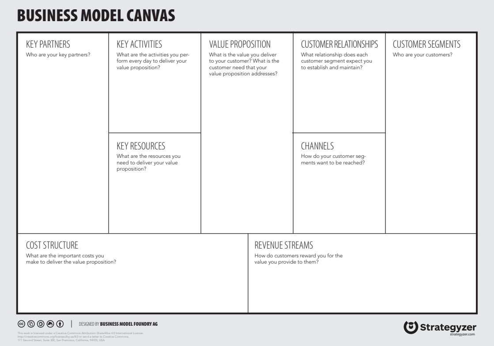
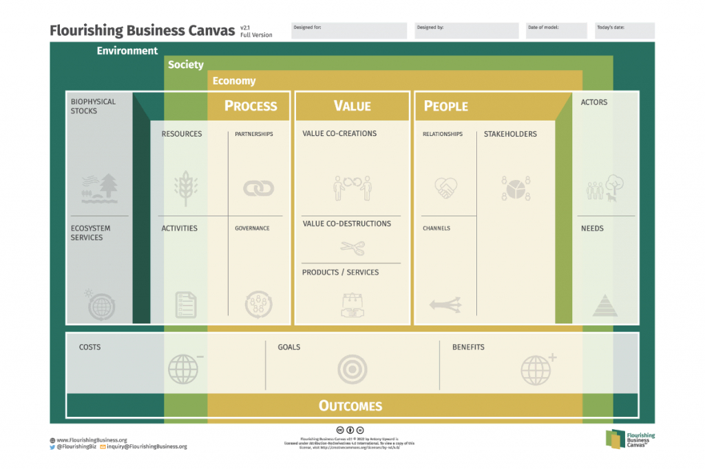

  

## Business models {.smaller background-image="figures/template_5.jpg"}
  
**Business model**: A business model describes the rationale of how an organization creates, delivers, and captures value.

{fig-align=center}

## Flourishing business models canvas {.smaller background-image="figures/template_5.jpg"}

**Sustainable business models**: A sustainable business model is a business model that creates, delivers, and captures value in a way that is sustainable for the environment, society, and the economy.

{fig-align=center}

## Interviews and surveys following BS {background-image="figures/template_5.jpg"}

[See here](https://mislav.quarto.pub/dawetrest-business-model-questionnaire/){target="_blank"}

## Data Used in Business Model Preparation {.smaller background-image="figures/template_5.jpg"}

- **Environmental Data** - Data portal - water quality, biodiversity indicators, carbon sequestration data.
- **Socio-economic Data** - macro data, local employment, business subject dynamics.
- **Community and Stakeholder Feedback** - community surveys, interviews.

## Data science principles:
  
  - **Dynamic** - automatic updates when new data is ingested or parameters are changed.
- **Interactive** - allow users to explore data and insights.
- **Reproducible** - reproducible by other teams using the same datasets and methods.
- **Versioning and Traceability** - track all changes to data, code, and reports.
- **Open source** - use open-source tools and libraries to ensure transparency and collaboration.

## All oin one document {.smaller background-image="figures/template_5.jpg"}

- Methodology part is in the document on teams: ~/WP6/Business models literature materials/business_models_methodology.docx

- fast look at [link](https://mislav.quarto.pub/business-models-methodology-e954/){target="_blank"}

